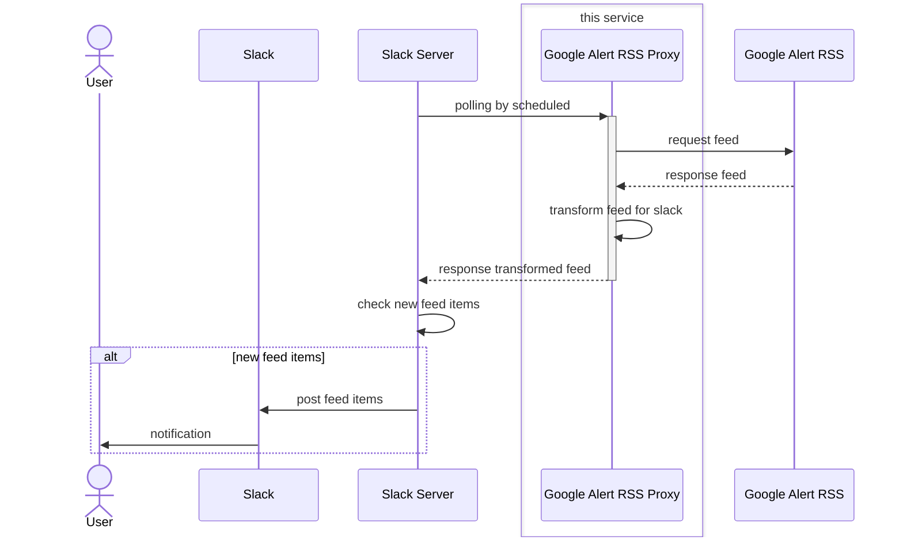

## Google Alert RSS 変換プロキシー

-   概要
    -   Google Alert の生成する RSS を Slack / Teams 等から使いやすくするために変換
    -   Google Cloud Functions の利用を想定
-   機能
    -   エントリの URL を参照先に変換し、Slack 等 で URL 展開されるようにする
    -   重複タイトルのエントリを除去（レーベンシュタイン距離で判定）
    -   余計な修飾や情報の削除

## 処理シーケンス

## 利用方法

https://{デプロイ URL}?feed={google alert rss}
