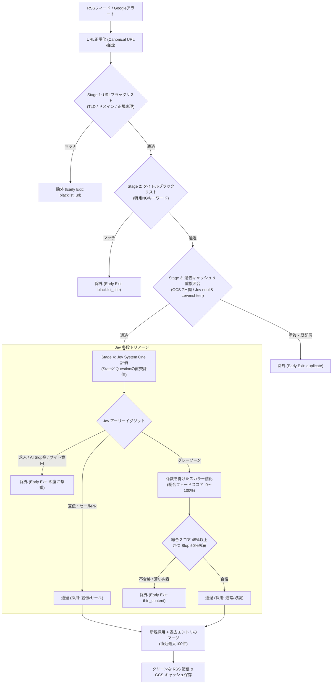

# Google Alert RSS 変換プロキシ

Google Alert が生成する RSS フィードを、Slack や RSS リーダー等で扱いやすく最適化して配信する Google Cloud Functions (Gen 2) 向けの変換プロキシです。

---

## 主な機能

1. **URL の正規化 (Canonical URL)**
   - Google リダイレクト URL (`https://www.google.com/url?...&url=...`) から実コンテンツの参照先 URL を抽出します。
   - Slack 等で URL が正しく展開・プレビューされるようになります。

2. **スコア蓄積型 Early Exit 多段除外パイプライン**
   - エントリは以下の順序で評価され、除外条件を満たした時点で **Early Exit（即時脱落）** します。後続の不要な処理（特に高コストな LLM 呼び出し）をスキップします。
   - **Stage 1: URL ブラックリスト (`BlacklistUrlFilter`)**:
     - スパム TLD (`.xyz`, `.buzz` 等) や特定ドメイン、正規表現パターンにマッチする URL を即時除外。
   - **Stage 2: タイトル ブラックリスト (`BlacklistTitleFilter`)**:
     - 「PR記事」「広告」「投資詐欺」などの特定 NG キーワードを含むタイトルを除外。
   - **Stage 3: 重複判定 (`DuplicateFilter`)**:
     - 同一 URL の重複を即時除外。
     - タイトルのレーベンシュタイン距離による高速候補抽出に加え、**Jev System One の `is_duplicate` (noul)** による意味的判定を行い、言い回しが異なる同一ニュース・重複記事も高精度に除外（Jev 未設定・通信障害時は従来の類似度判定へ自動フォールバック）。
     - **GCS キャッシュに蓄積された過去最大7日分の全エントリとも比較**し、過去に配信済みのエントリの再通知を防止。
   - **Stage 4: ジャンルブラックリスト (`GenreFilterStrategy`)**:
     - **Jev System One API** (`https://api.typesafe.ai/v1/systemone`) を活用し、高精度なトリアージ判定を実行。
     - **求人・募集記事 (`job_posting`)**: 転職・採用・アルバイト・業務委託案件・副業募集などを除外。
     - **AI Slop (`ai_slop`)**: 汎用LLMによる薄い自動生成まとめ、定型文の羅列、独自取材や一次情報が皆無のスパム記事を除外（Slop 確信度 >= 60%）。
     - **サイト案内 (`site_utility`)**: サイトトップページ、利用規約、ログイン画面等の静的ページを除外。
     - **低品質・無内容 (`thin_content`)**: 内容が希薄な記事を除外。
     - **価値ある記事の採用**: 技術解説 (`tech_guide`)、業界ニュース (`industry_news`)、考察 (`opinion_essay`)、新製品・セールPR (`promo_marketing`) などの有益コンテンツのみを通過。

3. **除外URLのレビュー用ログ出力 (Logging)**
   - パイプライン内で除外された URL は、除外理由とともに `INFO` レベルで出力されます（※過去記事とのURL・タイトル完全一致など機械的重複はノイズ軽減のためログ対象外ですが、**Jev による意味的重複除外 (`duplicate_jev`)** は後からの閾値調整や精度検証のために出力されます）。
   - 例:
     - `[EXCLUDED:blacklist_url] url=https://spam.xyz/..., title=...`
     - `[EXCLUDED:blacklist_title] url=https://..., title=...`
     - `[EXCLUDED:duplicate_jev] url=https://..., title=... (noul=0.85, threshold=0.60, candidate=...)`
     - `[EXCLUDED:job_posting] url=https://..., title=...`
     - `[EXCLUDED:ai_slop] url=https://..., title=... (slop=85%, score=15%)`
   - Cloud Logging で `jsonPayload.message =~ "\[EXCLUDED"` でクエリすることで、除外された URL と理由を簡単にレビューできます。

4. **Google Cloud Storage (GCS) によるフィードキャッシュ & エントリ保持**
   - 展開・変換済みの RSS フィードを GCS にキャッシュ。
   - キャッシュ有効期限内は GCS から即座に応答し、高速化と外部 API 呼び出しコストの削減を実現。
   - キャッシュ更新時は新旧エントリをマージし、**最大7日分のエントリを蓄積・維持**（7日を超えた古いエントリは自動破棄）。これらを次回の重複判定に活用。

---

## 処理フロー


```mermaid
flowchart TD
    Start["RSSフィード / Googleアラート"] --> Normalize["URL正規化 (Canonical URL抽出)"]
    Normalize --> S1{"Stage 1: URLブラックリスト<br/>(TLD / ドメイン / 正規表現)"}
    S1 -->|マッチ| E1["除外 (Early Exit: blacklist_url)"]

    S1 -->|通過| S2{"Stage 2: タイトルブラックリスト<br/>(特定NGキーワード)"}
    S2 -->|マッチ| E2["除外 (Early Exit: blacklist_title)"]

    S2 -->|通過| S3{"Stage 3: 過去キャッシュ & 重複照合<br/>(GCS 7日間 / Jev noul & Levenshtein)"}
    S3 -->|重複・既配信| E3["除外 (Early Exit: duplicate)"]

    S3 -->|通過| S4["Stage 4: Jev System One 評価<br/>(StateとQuestionの直交評価)"]

    subgraph JevTriage ["Jev 多段トリアージ"]
        S4 --> JevExit{"Jev アーリーイグジット"}
        JevExit -->|求人 / AI Slop高 / サイト案内| E4["除外 (Early Exit: 即座に撃墜)"]
        JevExit -->|宣伝・セールPR| Pass1["通過 (採用: 宣伝/セール)"]
        JevExit -->|グレーゾーン| ScalarScore["係数を掛けたスカラー値化<br/>(総合フィードスコア: 0〜100%)"]
        ScalarScore --> ThresholdCheck{"総合スコア 45%以上<br/>かつ Slop 50%未満"}
        ThresholdCheck -->|不合格 / 薄い内容| E5["除外 (Early Exit: thin_content)"]
        ThresholdCheck -->|合格| Pass2["通過 (採用: 通常/必読)"]
    end

    Pass1 --> Merge["新規採用 + 過去エントリのマージ<br/>(直近最大100件)"]
    Pass2 --> Merge
    Merge --> Output["クリーンな RSS 配信 & GCS キャッシュ保存"]
```

---

## 利用方法

### 1. 通常アクセス（推奨）

フィード URL パラメータ `feed` に Google Alert の RSS URL を指定してアクセスします。

```http
GET https://{デプロイURL}/?feed=https://www.google.co.jp/alerts/feeds/{USER_ID}/{ALERT_ID}
```

- 初回アクセス時、またはキャッシュ有効期限（TTL: 30分）が切れている場合は、最新フィードを取得・変換して GCS に保存した上で返却します。
- キャッシュが有効な場合は、GCS からキャッシュ済み RSS を即時返却します。

### 2. 強制リフレッシュ

GCS キャッシュを無視して、今すぐ Google Alerts から最新フィードを取得・更新したい場合は、`refresh=true` を付与します。

```http
GET https://{デプロイURL}/?feed=https://www.google.co.jp/alerts/feeds/{USER_ID}/{ALERT_ID}&refresh=true
```

---

## キャッシュと設定

設定ファイルは `src/conf/` ディレクトリ配下で管理されます。

### 1. GCS キャッシュ設定 (`src/conf/gcs_config.json`)

```json
{
  "gcs_bucket_name": "bulldra-api-storage",
  "gcs_root_dir": "google_alert_feed",
  "ttl_minutes": 30,
  "max_days": 7,
  "max_feed_count": 100
}
```

| 設定項目 | 説明 | デフォルト値 | 環境変数上書き |
| :--- | :--- | :--- | :--- |
| `gcs_bucket_name` | キャッシュを保存する GCS バケット名 | `bulldra-api-storage` | `GCS_BUCKET_NAME` |
| `gcs_root_dir` | バケット内のルートディレクトリ名 | `google_alert_feed` | `GCS_ROOT_DIR` |
| `ttl_minutes` | キャッシュの有効期間（分） | `30` | - |
| `max_days` | キャッシュに蓄積・重複判定に利用する日数 | `7` | - |
| `max_feed_count` | フィード内に保持する最大エントリ数 | `100` | - |

- **保存ファイル名**: フィード URL の識別子に基づき、`{gcs_root_dir}/feed/{USER_ID}_{ALERT_ID}.rss` として保存されます。

### 2. ジャンル判定・AI 設定

`GenreFilterStrategy` では **Jev System One API** を使用します。
- API キーは Google Cloud Secret Manager の `JEV_API_KEY` を Cloud Functions にマウントして利用します。
- ローカル環境では `.env` ファイル内の `JEV_API_KEY` または `jev_api_key` から自動読み込みされます。


### 3. ブラックリスト設定 (`src/conf/blacklist.json`)

- `tlds`: 除外するトップレベルドメイン（例: `xyz`, `buzz` 等）
- `domains`: 除外するドメイン（例: `shein.com`, `doda.jp` 等）
- `patterns`: 除外する URL 正規表現パターン
- `title_keywords`: 除外するタイトル内キーワード

---

## 開発 & テスト

### 依存関係のセットアップ

```bash
uv sync
```

### テスト実行

```bash
uv run pytest
```

### 静的解析 & 型チェック

```bash
uv run ruff check .
uv run mypy src tests
```

### デプロイ

```bash
./deploy.sh
```
